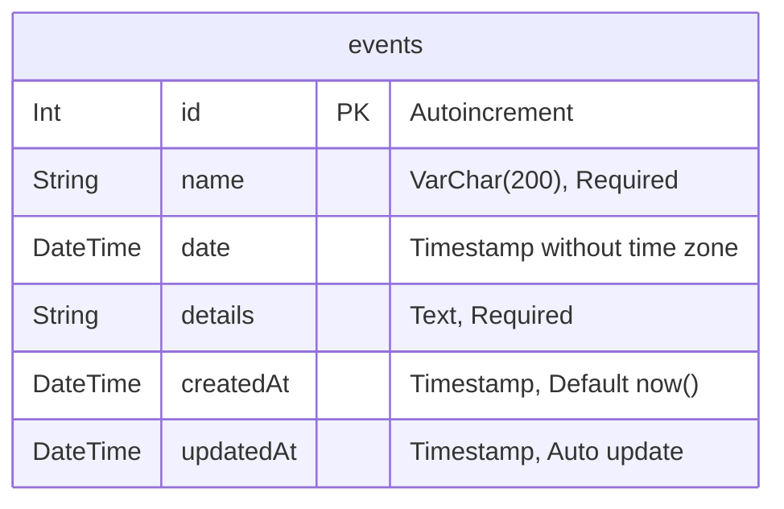

# Event Management System — Database Design & Schema

This document details the database architecture, schema definitions, and migration guidelines for the Event Management project.

## Database Engine

- **RDBMS:** PostgreSQL (Version 14+)
- **ORM:** Prisma ORM (v5)
- **Local Dev Container:** PostgreSQL 15 via Docker Compose

---

## Entity-Relationship Diagram



---

## Table Structure: `events`

| Column | Type | Constraints | Description |
|---|---|---|---|
| `id` | `SERIAL` / `INTEGER` | `PRIMARY KEY`, `NOT NULL` | Auto-incrementing unique identifier |
| `name` | `VARCHAR(200)` | `NOT NULL` | Name / Title of the event |
| `date` | `TIMESTAMP(3)` | `NOT NULL` | Scheduled date and time of the event |
| `details` | `TEXT` | `NOT NULL` | Detailed description of the event |
| `createdAt` | `TIMESTAMP(3)` | `DEFAULT CURRENT_TIMESTAMP`, `NOT NULL` | Record creation timestamp |
| `updatedAt` | `TIMESTAMP(3)` | `NOT NULL` | Timestamp updated automatically on modifications |

---

## Prisma Schema Definition

File location: `backend/prisma/schema.prisma`

```prisma
generator client {
  provider = "prisma-client-js"
}

datasource db {
  provider = "postgresql"
  url      = env("DATABASE_URL")
}

model Event {
  id        Int      @id @default(autoincrement())
  name      String   @db.VarChar(200)
  date      DateTime
  details   String   @db.Text
  createdAt DateTime @default(now()) @map("created_at")
  updatedAt DateTime @updatedAt @map("updated_at")

  @@map("events")
}
```

---

## Database Migrations & Commands

### 1. Start Database Service
```bash
docker compose up -d
```

### 2. Run Migrations (Development)
```bash
cd backend
npx prisma migrate dev --name init_events_table
```

### 3. Generate Prisma Client
```bash
npx prisma generate
```

### 4. Prisma Studio (GUI Browser for Data)
```bash
npx prisma studio
```
Prisma Studio opens at `http://localhost:5555` to view, query, and edit rows directly in your browser.

---

## Production Migration
For CI/CD and production environments:
```bash
npx prisma migrate deploy
```

---

## Future Schema Expansion (Roadmap)

When extending the system, the schema is designed to scale cleanly:

1. **User Authentication & Ownership:**
   - `users` table (`id`, `email`, `password_hash`, `name`, `role`).
   - Add `userId` foreign key to `events` table.
2. **Categories / Tags:**
   - `categories` table (`id`, `name`, `slug`).
   - `event_categories` join table for many-to-many relationship.
3. **Attendees / RSVPs:**
   - `attendees` table (`id`, `eventId`, `userId`, `status`, `registeredAt`).
4. **Location / Venue:**
   - Add `location` string or relation to a `venues` table.
